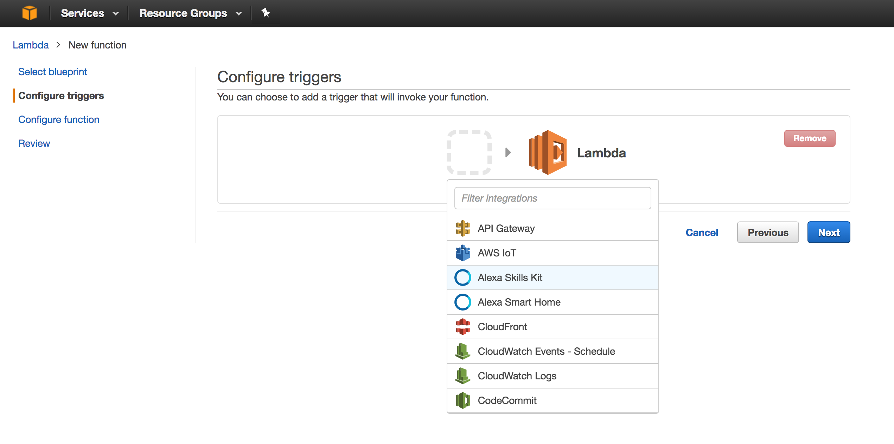
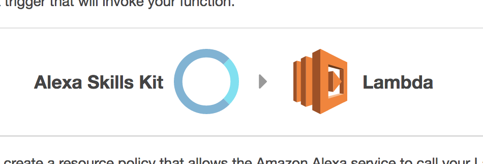

# Alexa custom skill - Meraki

A sample custom skill using the Amazon Alexa Service with the Meraki Dashboard and Tropo API's

## Resources used:
  * Amazon Alexa Skills Kit
    * developer.amazon.com/alexa-skills-kit
  * Amazon Web Services (AWS) Lambda
    * Screenshots of Lambda trigger configuration below
  * Meraki Dashboard API
    * developers.meraki.com
  * Tropo API
    * www.tropo.com/docs

## Description
The Alexa custom skill is tied to an AWS Lambda function (Python).

The Lambda function performs the fetching of information triggered by different matching "intents" configured under the custom skill in the Amazon developer console.

The returned information is parsed into 'speech_output' and read back by Alexa

## Configuring the Lambda trigger
  * Select the Alexa Skills Kit as the Lambda trigger:

